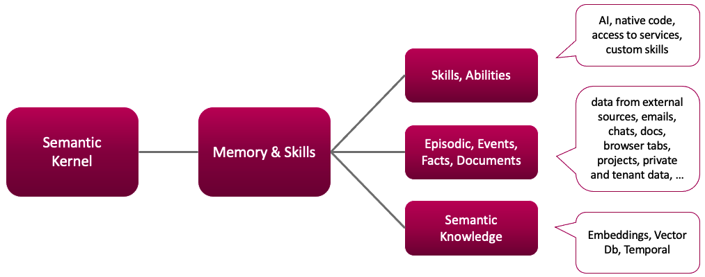
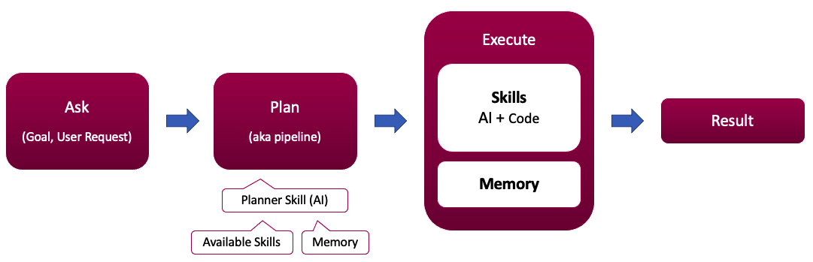

## notebook

### 使用笔记本

- vscode安装 polyglot notebook

- 打开[semantic-kernel/dotnet/notebooks at main · microsoft/semantic-kernel](https://github.com/microsoft/semantic-kernel/tree/main/dotnet/notebooks)


- 语义插件（Semantic Plugin）是语义函数的集合，其中每个函数都用自然语言定义，自然语言可以通过文本文件提供。


### 术语表

- **语义内核**（Semantic Kernel, SK）- 协调者，它通过SK可用的插件（PLUGINS）来满足用户的请求（ASK）。
- **请求**（Ask）- 用户向语义内核提出的要求，以协助达成用户的目标。
  - “我们向SK提出请求（ASKs）”
- **插件**（Plugins）- 一系列针对特定领域的、经过精细调整的函数集合，作为整体提供给SK使用。
  - “我们有一个用于更好地使用Office的插件”
- **函数**（Function）- 由语义AI和/或原生代码组成的计算单元，存在于某个插件（PLUGIN）中。
  - “Office插件包含许多函数（FUNCTIONS）” 
- **原生函数**（Native Function）- 使用传统编程语言（如C#、Python、TypeScript）表达，并能与SK轻松集成。
- **语义函数**（Semantic Function）- 在文本文件 "skprompt.txt" 中以自然语言表述，采用SK提示模板语言。每个语义函数都由一个独特的提示模板文件定义，这些文件是利用现代提示工程技术开发的。
- **记忆**（Memory）- 一个基于事实、事件、文档的语义知识集合，通过嵌入式索引进行组织。 

> - 内核设计鼓励函数组合，允许用户将多个函数（原生和语义）合并成单一的流水线。





config.json

```json
{
  "schema": 1,
  "description": "Generate a funny joke",
  "execution_settings": [
    {
      "max_tokens": 1000,
      "temperature": 0.9,
      "top_p": 0.0,
      "presence_penalty": 0.0,
      "frequency_penalty": 0.0
    }
  ]
}
```


### function calling

- 配置迁移：[Migrating to the new Function Calling capabilities | Microsoft Learn](https://learn.microsoft.com/en-gb/semantic-kernel/support/migration/function-calling-migration-guide?pivots=programming-language-csharp)

```cs
// Before
var executionSettings = new OpenAIPromptExecutionSettings { ToolCallBehavior = ToolCallBehavior.AutoInvokeKernelFunctions };

// After
var executionSettings = new OpenAIPromptExecutionSettings { FunctionChoiceBehavior = FunctionChoiceBehavior.Auto() };
```

- 调用时候还可以通过使用 `IChatCompletionService` 运行它，以访问 `ChatHistory` 对象，以查看哪些函数作为函数调用过程的一部分被调用。注意，需要将 Kernel 作为参数传递给 `GetChatMessageContentAsync` 方法，因为 Kernel 包含有关可用插件的信息。

```cs
var chatCompletionService = kernel.GetRequiredService<IChatCompletionService>();

var chatHistory = new ChatHistory();

chatHistory.AddUserMessage(ask);

var chatCompletionResult = await chatCompletionService.GetChatMessageContentAsync(chatHistory, openAIPromptExecutionSettings, kernel);

Console.WriteLine($"Result: {chatCompletionResult}\n");
Console.WriteLine($"Chat history: {JsonSerializer.Serialize(chatHistory)}\n");
```


### 函数嵌套


### 向量存储

> - https://github.com/microsoft/semantic-kernel/blob/main/dotnet/notebooks/06-vector-stores-and-embeddings.ipynb

- 之前主要将内核视为无状态编排引擎，即文本发送到模型 API 并接收文本。
- 但是如果仅依赖内核参数，最终 prompt 会变得巨大，以至于会遇到模型的 token 限制。所以需要的是一种持久化状态并构建短期和长期内存的方法，以增强更智能的应用程序。

**安装**

- Package `Microsoft.Extensions.VectorData.Abstractions` ，其中包含使用矢量存储所需的所有抽象。

- 然后还需要使用具体数据库连接器的实现。此处使用内存中连接器进行演示 - `Microsoft.SemanticKernel.Connectors.InMemory` 。
  - 支持的连接器：Azure AI Search、Azure CosmosDB、Qdrant、Redis 等。[更多连接器](https://learn.microsoft.com/en-us/semantic-kernel/concepts/vector-store-connectors/out-of-the-box-connectors/)

**定义模型**

- 在抽象中，有三种主要的数据模型属性类型：

  - Key 键

  - Data 数据

  - Vector 向量

- 一般数据模型包含一个 key 属性、多个 data 和 vector 属性
  - 某些连接器可能有限制，例如当仅支持一个 vector property 时。
  - 此外，每个连接器都支持一组不同的属性类型。[连接器支持的属性类型](https://learn.microsoft.com/en-us/semantic-kernel/concepts/vector-store-connectors/out-of-the-box-connectors/)。

- 有两种方法可以定义数据模型
  - 使用特性（声明式方式）
  - 记录定义（命令式方式）
- 以下使用特性定义

```cs
public sealed class Glossary
{
    [VectorStoreRecordKey]
    public ulong Key { get; set; }

    [VectorStoreRecordData]
    public string Term { get; set; }

    [VectorStoreRecordData]
    public string Definition { get; set; }

    [VectorStoreRecordVector(Dimensions: 2560)]
    public ReadOnlyMemory<float> DefinitionEmbedding { get; set; }
}
```

- 在某些情况下无法使用特性添加到现有类上。此时可以定义一个单独的记录定义，其中包含有关属性的所有信息。注意这种情况下，定义的数据模型类仍然是必需的：

```cs
public sealed class GlossaryWithoutAttributes
{
    public ulong Key { get; set; }

    public string Term { get; set; }

    public string Definition { get; set; }

    public ReadOnlyMemory<float> DefinitionEmbedding { get; set; }
}

var recordDefinition = new VectorStoreRecordDefinition()
{
    Properties = new List<VectorStoreRecordProperty>()
    {
        new VectorStoreRecordKeyProperty("Key", typeof(ulong)),
        new VectorStoreRecordDataProperty("Term", typeof(string)),
        new VectorStoreRecordDataProperty("Definition", typeof(string)),
        new VectorStoreRecordVectorProperty("DefinitionEmbedding", typeof(ReadOnlyMemory<float>)) { Dimensions = 1536 }
    }
};
```

**向量存储库和集合创建**

- 定义数据模型后就可以开始在选择的数据库中使用它，涉及到的抽象接口

  - `IVectorStoreRecordCollection<TKey, TRecord>`：表示一个集合。此集合可能存在也可能不存在，并且提供了检查集合是否存在、创建、更新插入、获取和删除记录的方法。该接口继承自 `IVectorizedSearch<TRecord>`，提供向量搜索功能。

  - `IVectorStore`：包含跨向量存储中所有集合的操作，例如 `ListCollectionNames`。它还提供获取 `IVectorStoreRecordCollection<TKey, TRecord>` 实例的功能。

  - 每个连接器都有扩展方法支持依赖注入：`services.AddInMemoryVectorStore()` 或 `services.AddInMemoryVectorStoreRecordCollection("collection-name")` 。

- 以下直接初始化实例使用，集合类似于关系数据库中的表。

```cs
// 创建向量存储库
var vectorStore = new InMemoryVectorStore();
// 通过向量存储库获取集合
var colleciton = vectorStore.GetCollection<ulong, Glossary>("skglossary");
// 通过直接初始化获取集合
var colleciton2 = new InMemoryVectorStoreRecordCollection<ulong, Glossary>("skglossary");
// 确保集合存在于数据库中
await colleciton.CreateCollectionIfNotExistsAsync();
```

**文本向量化存储**

- 首先需要对源数据集合遍历处理生成向量，使用ITextEmbeddingGenerationService的GenerateEmbeddingAsync方法。此时会请求embedding接口。
- 向量化完成后，使用collection的UpsertAsync或UpsertBatchAsync 方法存入向量数据库中。
  - 此操作幂等：如果不存在具有特定键的记录，则会插入该记录。如果它已存在，则将对其进行更新

```cs
// 准备数据
List<Glossary> glossaryEntries =
[
    new Glossary()
    {
        Key = 1,
        Term = "API",
        Definition =
            "Application Programming Interface. A set of rules and specifications that allow software components to communicate and exchange data.",
    },
    new Glossary()
    {
        Key = 2,
        Term = "Connectors",
        Definition =
            "Connectors allow you to integrate with various services provide AI capabilities, including LLM, AudioToText, TextToAudio, Embedding generation, etc.",
    },
    new Glossary()
    {
        Key = 3,
        Term = "RAG",
        Definition =
            "Retrieval Augmented Generation - a term that refers to the process of retrieving additional data to provide as context to an LLM to use when generating a response (completion) to a user's question (prompt).",
    },
];


// 如果想对数据库中的记录执行向量搜索，仅初始化 key 和 data 属性是不够的，还需要生成和初始化向量属性。为此，可以使用 ITextEmbeddingGenerationService。
var textEmbeddingGenerationService =
    kernel.GetRequiredService<ITextEmbeddingGenerationService>();
var tasks = glossaryEntries.Select(e =>
    Task.Run(async () =>
    {
        e.DefinitionEmbedding = await textEmbeddingGenerationService.GenerateEmbeddingAsync(
            e.Definition
        );
    })
);
await Task.WhenAll(tasks);


// 插入到数据库中。可以使用collection的UpsertAsync或UpsertBatchAsync 方法。此操作幂等 - 如果不存在具有特定键的记录，则会插入该记录。如果它已存在，则将对其进行更新
await foreach (var key in colleciton.UpsertBatchAsync(glossaryEntries))
{
    Console.WriteLine(key);
}
```

**查询向量数据**

- 使用 collection.GetAsync 或 GetBatchAsync按键获取记录。支持GetRecordOptions作为参数指定是否要在响应中包含向量属性。
  - 因为 vector 维度值可能很高，不推荐从数据库中获取。所以 GetRecordOptions.IncludeVectors = false 是默认值。（这里为了测试所以需要看到向量）

```cs
var options = new GetRecordOptions() { IncludeVectors = true };
await foreach (var record in colleciton.GetBatchAsync(keys: [1, 2, 3], options))
{
    System.Console.WriteLine(record.Definition);
    await record.SerializeObjectToFile();
}
```

**搜索向量**

- 查询字符串再调用embedding服务生成搜索向量。
- 然后使用IVectorStoreRecordCollection的VectorizedSearchAsync方法搜索，其接受 VectorSearchOptions 作为参数允许配置向量搜索操作
  - 指定要返回的最大记录数、返回结果之前要跳过的结果数、在执行向量搜索之前要使用的搜索过滤器等。

```cs
// 搜索，，
var searchString = "I want to learn more about Connectors";
var searchVector = await textEmbeddingGenerationService.GenerateEmbeddingAsync(
    searchString
);

var searchResult = await colleciton.VectorizedSearchAsync(searchVector);
await foreach (var result in searchResult.Results)
{
    Console.WriteLine($"Search score: {result.Score}");
    Console.WriteLine($"Key: {result.Record.Key}");
    Console.WriteLine($"Term: {result.Record.Term}");
    Console.WriteLine($"Definition: {result.Record.Definition}");
    Console.WriteLine("=========");
}
```

- 结果

```
Search score: 0.785374104976654
Key: 2
Term: Connectors
Definition: Connectors allow you to integrate with various services provide AI capabilities, including LLM, AudioToText, TextToAudio, Embedding generation, etc.
=========
Search score: 0.7311795353889465
Key: 1
Term: API
Definition: Application Programming Interface. A set of rules and specifications that allow software components to communicate and exchange data.
=========
Search score: 0.6290566325187683
Key: 3
Term: RAG
Definition: Retrieval Augmented Generation - a term that refers to the process of retrieving additional data to provide as context to an LLM to use when generating a response (completion) to a user's question (prompt).
=========
```


### 图像生成

- 以下使用 OpenAI DALL-E 3 生成图像，并结合其他 LLM 功能（如文本和嵌入生成）。

- 首先使用 Chat Completion 生成随机图像描述然后 DALL-E 3 从该描述创建图像，并内联显示图像。
- 最后要求用户描述图像。使用 Cosine Similarity 将用户描述的嵌入与原始描述进行比较，并返回从 0 到 1 的分数，其中 1 表示完全匹配。
- 安装
  - System.Numerics.Tensors
  - SkiaSharp

- 准备服务

```cs
builder.AddOpenAITextEmbeddingGeneration("text-embedding-ada-002", apiKey, orgId); // 用于将猜测与真实图像描述进行比较
builder.AddOpenAIChatCompletion(model, apiKey, orgId);
builder.AddOpenAITextToImage(apiKey, orgId); // 默认就是OpenAI Dall-E 3
```

**生成图片**

```cs
var prompt = @"
思考一个与数字{{$input}}有关的人工制品。
用一句详细的话来描述这个图像。描述中不能包含数字。";

var executionSettings = new OpenAIPromptExecutionSettings 
{
    MaxTokens = 256,
    Temperature = 1
};

// 创建一个语义函数，用于生成随机图像描述。
var genImgDescription = kernel.CreateFunctionFromPrompt(prompt, executionSettings);

var random = new Random().Next(0, 200);
var imageDescriptionResult = await kernel.InvokeAsync(genImgDescription, new() { ["input"] = random });
var imageDescription = imageDescriptionResult.ToString();

// 使用DALL-E 3来生成一张图片。在这个例子中OpenAI返回的是一个URL（虽然可以要求它返回base64编码的图片）
var imageUrl = await dallE.GenerateImageAsync(imageDescription.Trim(), 1024, 1024);

await SkiaUtils.ShowImage(imageUrl, 1024, 1024);
```

- 尝试猜测图像是关于什么的。

```cs
// 提示用户猜测图像的内容
var guess = await InteractiveKernel.GetInputAsync("请用你自己的话描述这张图片");

// 比较用户的猜测与实际描述并计算得分
var origEmbedding = await textEmbedding.GenerateEmbeddingsAsync(new List<string> { imageDescription });
var guessEmbedding = await textEmbedding.GenerateEmbeddingsAsync(new List<string> { guess });
var similarity = TensorPrimitives.CosineSimilarity(origEmbedding.First().Span, guessEmbedding.First().Span);

Console.WriteLine($"你的描述:\n{Utils.WordWrap(guess, 90)}\n");
Console.WriteLine($"实际描述:\n{Utils.WordWrap(imageDescription.Trim(), 90)}\n");
Console.WriteLine($"得分: {similarity:0.00}\n\n");

// 取消注释以下行以查看OpenAI提供的URL
// Console.WriteLine(imageUrl);
```


### 带有 BingSearch 的 RAG

- 如何将必应搜索与语义内核集成，以便从 Internet 获取最新信息。

- 使用 Bing 搜索需要 API 密钥，通过在 Azure 中创建[必应搜索资源](https://learn.microsoft.com/en-us/bing/search-apis/bing-web-search/create-bing-search-service-resource)来获取 API 密钥。

**安装**

- Microsoft.SemanticKernel.Plugins.Web
- Microsoft.SemanticKernel.Plugins.Core
- Microsoft.SemanticKernel.PromptTemplates.Handlebars

**BingSearch密钥**

- 使用 [`.NET Interactive`](https://github.com/dotnet/interactive/blob/main/docs/kernels-overview.md) 中引入的 `InteractiveKernel` 方法在 BING_KEY 中输入 Bing 搜索密钥

```cs
using InteractiveKernel = Microsoft.DotNet.Interactive.Kernel;

string BING_KEY = (await InteractiveKernel.GetPasswordAsync("Please enter your Bing Search Key")).GetClearTextPassword();
```


**基本搜索插件**

- 以下演示如何从 `BingTextSearch` 的实例创建名为 SearchPlugin 的插件。
- 使用 `CreateWithSearch` 会创建一个新插件，其中包含一个调用底层文本搜索实现的 Search 函数。SearchPlugin 被添加到 Kernel 中，使它可以在提示渲染期间被调用。
- 提示模板包括一个调用，该 `{{SearchPlugin.Search $query}}` 调用将调用 SearchPlugin 来检索与当前查询相关的结果。然后结果将插入到呈现的提示中，然后再将其发送到 AI 模型。

```cs
// 创建一个使用OpenAI聊天补全的内核
var builder = Kernel.CreateBuilder();

// 配置内核使用的AI后端
var (useAzureOpenAI, model, azureEndpoint, apiKey, orgId) = Settings.LoadFromFile();
if (useAzureOpenAI)
    builder.AddAzureOpenAIChatCompletion(model, azureEndpoint, apiKey);
else
    builder.AddOpenAIChatCompletion(model, apiKey, orgId);
var kernel = builder.Build();

// 使用Bing搜索创建一个文本搜索工具
#pragma warning disable SKEXP0050
var textSearch = new BingTextSearch(apiKey: BING_KEY);

// 构建一个带有必应搜索功能的文本搜索插件，并添加到内核中
var searchPlugin = textSearch.CreateWithSearch("SearchPlugin");
kernel.Plugins.Add(searchPlugin);

// 调用提示并使用文本搜索插件来提供基础信息
var query = "What is the Semantic Kernel?";
var prompt = "{{SearchPlugin.Search $query}}. {{$query}}";
KernelArguments arguments = new() { { "query", query } };
Console.WriteLine(await kernel.InvokePromptAsync(prompt, arguments));
```


**带引文的搜索插件**

- 下面的示例重复了上面描述的模式，但有些显著的变化。

  - `CreateWithGetTextSearchResults` 用于创建 `SearchPlugin`，该插件从底层文本搜索实现中调用 `GetTextSearchResults` 方法。

  - 提示模板使用 Handlebars 语法。这允许模板迭代搜索结果并呈现每个结果的名称、值和链接。

  - 该提示包含引用的说明，因此 AI 模型将执行向响应添加引用的工作。

```cs
// 创建带有 OpenAI 聊天完成的内核
var builder = Kernel.CreateBuilder();

// 配置内核使用的 AI 后端
var (useAzureOpenAI, model, azureEndpoint, apiKey, orgId) = Settings.LoadFromFile();
if (useAzureOpenAI)
    builder.AddAzureOpenAIChatCompletion(model, azureEndpoint, apiKey);
else
    builder.AddOpenAIChatCompletion(model, apiKey, orgId);
var kernel = builder.Build();

// 使用必应搜索创建文本搜索
#pragma warning disable SKEXP0050
var textSearch = new BingTextSearch(apiKey: BING_KEY);

// 构建一个带有必应搜索的文本搜索插件并添加到内核中
var searchPlugin = textSearch.CreateWithGetTextSearchResults("SearchPlugin");
kernel.Plugins.Add(searchPlugin);

// 调用提示，并使用文本搜索插件提供基础信息
var query = "什么是语义内核？";
string promptTemplate = """
{{#with (SearchPlugin-GetTextSearchResults query)}}  
    {{#each this}}  
    名称: {{Name}}
    内容: {{Value}}
    链接: {{Link}}
    -----------------
    {{/each}}  
{{/with}}  

{{query}}

在响应中引用相关资料的地方包含引文。
""";
KernelArguments arguments = new() { { "query", query } };
HandlebarsPromptTemplateFactory promptTemplateFactory = new();
Console.WriteLine(await kernel.InvokePromptAsync(
    promptTemplate,
    arguments,
    templateFormat: HandlebarsPromptTemplateFactory.HandlebarsTemplateFormat,
    promptTemplateFactory: promptTemplateFactory
));
```


**带有过滤器的搜索插件**

- 目前的示例使用排名靠前的 Web 搜索结果来提供接地数据。为了提高可靠性，可以将 Web 搜索限制仅返回指定站点的结果。
- 基于上一个示例添加搜索结果的筛选。带有相等子句的 `TextSearchFilter` 用于指定搜索结果中仅包含来自 Microsoft 开发人员博客站点 （ `site == 'devblogs.microsoft.com'` ）的结果。
- 该示例用于创建 `KernelPluginFactory.CreateFromFunctions` `SearchPlugin`。为插件提供了自定义描述。 `ITextSearch.CreateGetTextSearchResults` 扩展方法用于创建调用文本搜索服务的 `KernelFunction`。

```cs
// 创建带有 OpenAI 聊天完成的内核
var builder = Kernel.CreateBuilder();

// 配置内核使用的 AI 后端
var (useAzureOpenAI, model, azureEndpoint, apiKey, orgId) = Settings.LoadFromFile();
if (useAzureOpenAI)
    builder.AddAzureOpenAIChatCompletion(model, azureEndpoint, apiKey);
else
    builder.AddOpenAIChatCompletion(model, apiKey, orgId);
var kernel = builder.Build();

// 使用必应搜索创建文本搜索
#pragma warning disable SKEXP0050
var textSearch = new BingTextSearch(apiKey: BING_KEY);

// 创建一个筛选器，仅搜索 Microsoft Developer Blogs 网站
#pragma warning disable SKEXP0001
var filter = new TextSearchFilter().Equality("site", "devblogs.microsoft.com");
var searchOptions = new TextSearchOptions() { Filter = filter };

// 构建一个带有必应搜索的文本搜索插件，并添加到内核中，专门用于搜索 Microsoft Developer Blogs 网站
var searchPlugin = KernelPluginFactory.CreateFromFunctions(
    "SearchPlugin", "仅搜索 Microsoft Developer Blogs 网站",
    [textSearch.CreateGetTextSearchResults(searchOptions: searchOptions)]);
kernel.Plugins.Add(searchPlugin);

// 调用提示，并使用文本搜索插件提供基础信息
var query = "什么是语义内核？";
string promptTemplate = """
{{#with (SearchPlugin-GetTextSearchResults query)}}  
    {{#each this}}  
    名称: {{Name}}
    内容: {{Value}}
    链接: {{Link}}
    -----------------
    {{/each}}  
{{/with}}  

{{query}}

在响应中引用相关资料的地方包含引文。
""";
KernelArguments arguments = new() { { "query", query } };
HandlebarsPromptTemplateFactory promptTemplateFactory = new();
Console.WriteLine(await kernel.InvokePromptAsync(
    promptTemplate,
    arguments,
    templateFormat: HandlebarsPromptTemplateFactory.HandlebarsTemplateFormat,
    promptTemplateFactory: promptTemplateFactory
));
```


## xzy

### planner分步规划器

- 分步和 Handlebars 规划器仍可在语义内核中使用。 但是，建议对大多数任务使用函数调用，因为它更强大且更易于使用。 后续版本的SK中将弃用分步和 Handlebars 规划器。如果要生成新的 AI 代理，建议 *不要* 使用 Stepwise 或 Handlebars planners。 请改用函数调用，因为它更强大且更易于使用。
  - [.NET 从 Stepwise Planner 迁移到自动函数调用 | Microsoft Learn](https://learn.microsoft.com/zh-cn/semantic-kernel/support/migration/stepwise-planner-migration-guide?pivots=programming-language-csharp)

```cs
/// <summary>
/// 计划测试
/// </summary>
/// <param name="msg">
/// 案例输入：1.小明有7个冰淇淋，我有2个冰淇淋，他比我多几个冰淇淋？
/// 2.小明有7个冰淇淋，我有2个冰淇淋，我们一共有几个冰淇淋？
/// </param>
/// <returns></returns> <summary>
public async Task PlanTest(string msg)
{
    var planner = new HandlebarsPlanner(
        new HandlebarsPlannerOptions()
        {
            // 如果您想使用循环进行测试，而不管模型选择如何，请更改此设置。
            AllowLoops = true,
        }
    );
    kernel.ImportPluginFromDefaultPathPromptDirectory("Calculate");
    var plan = await planner.CreatePlanAsync(kernel, msg);
    Console.WriteLine("Plan:\n");
    Console.WriteLine(JsonSerializer.Serialize(plan));

    var res = await plan.InvokeAsync(kernel);
    System.Console.WriteLine(res);
}
```


### pipeline

```cs
/// <summary>
/// 管道 现在已经废弃了，使用的是dump之前的SK库代码
/// https://learn.microsoft.com/en-us/semantic-kernel/ai-orchestration/plugins/out-of-the-box-plugins?tabs=Csharp#whats-the-ms-graph-connector-kit
/// </summary>
/// <returns></returns>
public async Task PipelineTest()
{
    var textPlugin = kernel.ImportPluginFromType<TextPlugin>();
    KernelFunction pipeline = KernelFunctionCombinators.Pipe(
        [
            textPlugin["TrimStart"], //清除左边空格
            textPlugin["TrimEnd"], //清除右边空格
            textPlugin["Uppercase"], //转大写
        ],
        "pipeline"
    );
    var res = await pipeline.InvokeAsync(
        kernel,
        new KernelArguments() { ["input"] = "     i n f i n i t e     s p a c e     " }
    );
    System.Console.WriteLine(res);
}
```


- 相关代码

```cs
using System;
using Microsoft.SemanticKernel;

namespace SKUtils.SKExtensions;

public static class KernelFunctionCombinators
{
    /// <summary>
    /// 调用一个函数管道，按顺序运行每个函数，并将一个函数的输出作为下一个函数的第一个参数传递。
    /// </summary>
    /// <param name="functions">要调用的函数管道。</param>
    /// <param name="kernel">用于操作的内核。</param>
    /// <param name="arguments">参数。</param>
    /// <param name="cancellationToken">用于监视取消请求的取消令牌。</param>
    /// <returns>KernelFunction 运行结果</returns>
    public static Task<FunctionResult> InvokePipelineAsync(
        IEnumerable<KernelFunction> functions,
        Kernel kernel,
        KernelArguments arguments,
        CancellationToken cancellationToken
    ) => Pipe(functions).InvokeAsync(kernel, arguments, cancellationToken);

    /// <summary>
    /// 调用一个函数管道，按顺序运行每个函数，并将一个函数的输出作为命名参数传递给下一个函数。
    /// </summary>
    /// <param name="functions">要调用的函数序列，以及分配给函数调用结果的参数名称。</param>
    /// <param name="kernel">用于操作的内核。</param>
    /// <param name="arguments">参数。</param>
    /// <param name="cancellationToken">用于监视取消请求的取消令牌。</param>
    /// <returns>KernelFunction 运行结果</returns>
    public static Task<FunctionResult> InvokePipelineAsync(
        IEnumerable<(KernelFunction Function, string OutputVariable)> functions,
        Kernel kernel,
        KernelArguments arguments,
        CancellationToken cancellationToken
    ) => Pipe(functions).InvokeAsync(kernel, arguments, cancellationToken);

    /// <summary>
    /// 创建一个函数，其调用将依次调用每个提供的函数。
    /// </summary>
    /// <param name="functions">要调用的函数管道。</param>
    /// <param name="functionName">组合操作的名称。</param>
    /// <param name="description">组合操作的描述。</param>
    /// <returns>最后一个函数的结果。</returns>
    /// <remarks>
    /// 一个函数的结果将作为下一个函数的第一个参数传递。
    /// </remarks>
    public static KernelFunction Pipe(
        IEnumerable<KernelFunction> functions,
        string? functionName = null,
        string? description = null
    )
    {
        ArgumentNullException.ThrowIfNull(functions);
        KernelFunction[] funcs = functions.ToArray();
        Array.ForEach(funcs, f => ArgumentNullException.ThrowIfNull(f));

        // 创建一个包含函数和输出变量名的元组数组。如果不是最后一个函数，获取下一个函数的第一个参数名
        var funcsAndVars = new (KernelFunction Function, string OutputVariable)[funcs.Length];
        for (int i = 0; i < funcs.Length; i++)
        {
            string p = "";
            if (i < funcs.Length - 1)
            {
                var parameters = funcs[i + 1].Metadata.Parameters;
                if (parameters.Count > 0)
                {
                    p = parameters[0].Name;
                }
            }
            // 将当前函数和下一个函数的第一个参数名存入元组数组
            funcsAndVars[i] = (funcs[i], p);
        }
        return Pipe(funcsAndVars, functionName, description);
    }

    /// <summary>
    /// 创建一个函数，其调用将依次调用每个提供的函数。
    /// </summary>
    /// <param name="functions">要调用的函数管道，以及分配给函数调用结果的参数名称。</param>
    /// <param name="functionName">组合操作的名称。</param>
    /// <param name="description">组合操作的描述。</param>
    /// <returns>最后一个函数的结果。</returns>
    /// <remarks>
    /// 一个函数的结果将作为下一个函数的第一个参数传递。
    /// </remarks>
    public static KernelFunction Pipe(
        IEnumerable<(KernelFunction Function, string OutputVariable)> functions,
        string? functionName = null,
        string? description = null
    )
    {
        ArgumentNullException.ThrowIfNull(functions);

        (KernelFunction Function, string OutputVariable)[] arr = functions.ToArray();
        Array.ForEach(
            arr,
            f =>
            {
                ArgumentNullException.ThrowIfNull(f.Function);
                ArgumentNullException.ThrowIfNull(f.OutputVariable);
            }
        );
        // 使用 KernelFunctionFactory 创建一个新的 KernelFunction
        return KernelFunctionFactory.CreateFromMethod(
            async (Kernel kernel, KernelArguments arguments) =>
            {
                FunctionResult? result = null;
                // 遍历函数数组，依次调用每个函数。如果不是最后一个函数，将当前函数的结果存入参数集合中，作为下一个函数的输入
                for (int i = 0; i < arr.Length; i++)
                {
                    result = await arr[i]
                        .Function.InvokeAsync(kernel, arguments)
                        .ConfigureAwait(false);
                    if (i < arr.Length - 1)
                    {
                        arguments[arr[i].OutputVariable] = result.GetValue<object>();
                    }
                }

                return result;
            },
            functionName,
            description
        );
    }
}
```


